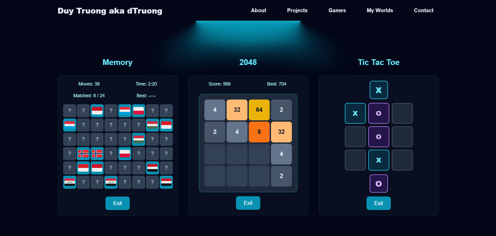

# My Simple Portfolio 

This is a web portfolio project built using TypeScript with React for the frontend (and Django for the backend - soon implement after... haiz ihavenoideathinkingthinking...).

## Examples


 

## Features

- 3D interactive portfolio
- Built-in board games
- Modern animations

## Tech Stack

- React 18, TypeScript, TailwindCSS
- Framer Motion for animations
- Custom 3D components

## 📁 Project Structure

```
frontend/
├── src/
│   ├── components/
│   │   ├── common/          # Shared components (Header, BoxesCore)
│   │   ├── sections/        # Page sections (Hero, About, Projects, etc.)
│   │   └── ui/              # Reusable UI components (ThreeDCard, ExternalLinkIcon)
│   ├── assets/              # Images, GIFs, and static assets
│   ├── styles/              # Global CSS and component styles
│   └── utils/               # Utility functions
├── public/                  # Static files and favicons
└── package.json
```

## 🚀 Getting Started

### Prerequisites
- Node.js (v16 or higher)
- npm or yarn

### Installation

1. **Clone the repository**
   ```bash
   git clone https://github.com/dtruowfng3/myPortfolio.git
   cd myPortfolio
   ```

2. **Install dependencies**
   ```bash
   cd frontend
   npm install
   ```

3. **Start the development server**
   ```bash
   npm start
   ```

4. **Open your browser**
   `http://localhost:3000` to view the portfolio

### Build for Production

```bash
npm run build
```

The built files will be in the `build` directory, ready for deployment.

## Customization

### Colors and Theme
The portfolio uses a cyan/blue color scheme defined in TailwindCSS. You can customize colors in:
- `tailwind.config.js` - Main color definitions
- Component files - Individual color overrides

### Content Updates
- **Personal Info**: Update `About.tsx` with your information
- **Projects**: Modify `Projects.tsx` to showcase your work
- **Skills**: Edit the skills array in `About.tsx`
- **Social Links**: Update links in `Hero.tsx` and `Contact.tsx`

### Adding New Sections
1. Create a new component in `src/components/sections/`
2. Import and add to `App.tsx`
3. Add navigation link in `Header.tsx`

## Deployment in GitHub Pages

1. Install gh-pages: `npm install --save-dev gh-pages`
2. Add deploy script to package.json:
   ```json
   "scripts": {
     "deploy": "gh-pages -d build"
   }
   ```
3. Build and deploy: `npm run build && npm run deploy`
4. Enable GitHub Pages in repository settings
5. Your site will be available at `https://username.github.io/repository-name`


## References UI Components

- [BoxesCore](https://ui.aceternity.com/components/background-boxes)
- [ThreeDCard](https://seraui.com/docs/threed-card)
- [ThreeDCarousel](https://seraui.com/docs/3d-carousel)
- [ExternalLinkIcon - Arrow >> icon ](https://seraui.com/docs/svg-icons)
- [Footer - Minimal](https://seraui.com/docs/footer)


⭐ Thank you!
